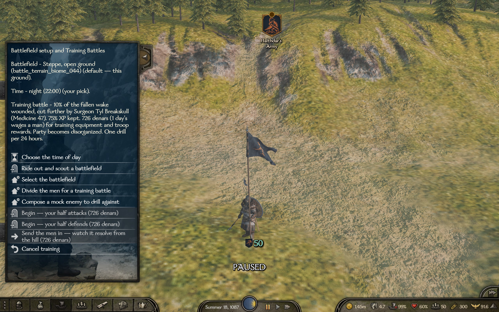

# Training Battles
- Split up your boys in two teams and do a drill battle
- Pick your battle ground (and time) before the drills and before the real battles


A mod for *Mount & Blade II: Bannerlord* built on two pillars:

## Pillar 1 — Training battles


- **Split your army** into two halves through a troop-picking GUI, choose which half you command
- **Pay** for the drill - broken javs, arrows, rewards, they cost money... (1 daily wage by default)
- **Fight** on the battlefield (attacking or defending) or auto resolve
- **Level up** your soldiers - keep the XP (75% by default)
- the **KIA** -> might get Wounded. Some really get injured (default to about 10%), further reduced by how good your surgeon is
- the **Wounded** -> they all get up OK
- **No loot** - no loot is preserved after (works even with Bannerloot mod)
- **Disorganized** after - they had to form up etc
- **Cooldown** - you have to wait before you can do another drill (24 in game hours by default)


*The muster menu (hotkey `G` on the map): set the ground and the hour, divide the men, pick your side — or just send them in and watch from the hill.*


*Your two halves meet on the real terrain of your map position. Nobody truly dies.*

**Mock enemy** *(optional, off by default)* — compose a phantom enemy force from **every
troop in the game**, all cultures in one picker screen, any mix, up to 1000 men — and drill
the whole company against it. The phantoms never touch your roster and vanish afterward;
your own men follow the normal training rules. The test bench for "how would we fare
against X?".


*Composing a mock enemy: every troop in the game, 500 of each on the shelf, any mix up to 1000 men.*


## Pillar 2 — Scouting & choosing your ground

What a real general does before the battle: know the field — and pick the hour.

- **Choose the time of day** — morning, noon, afternoon, evening, night, or the campaign clock (default). Applies to drills, real field battles, sieges and sea battles alike
- **Select the battlefield** — pick from every battlefield the game could use here: the map patch's own scene (marked *"this ground"*) plus every scene of the local terrain type
- **Ride out and scout** — walk any of those battlefields **alone**: no battle, no cost, no cooldown. You spawn on your deployment line, facing the enemy's, distance called out
- **Scouted lines = drilled lines** — drills use the same deterministic deployment as the scout, so what you scouted is what you get. In a *real* battle the ground holds, but the enemy's true approach direction may turn the field around
- **Same tools in REAL battles** *(per-side toggles, both on by default)* — the encounter menu offers the same options (hour, scout, battlefield) when defending **or** attacking. Both armies stand frozen, so the scouted lines and facings are **exact** — and no time passes while you ride
- **Rule of thumb** — scout from the muster to *learn* the battlefields, scout from the attack screen to *plan the actual fight*


*A real encounter: choose the hour, select the battlefield, or ride out and scout it alone — the armies stand where they stand, so the lines you see are the coming battle's true ones.*


*Choose the ground: the map patch's own scene plus every battlefield of the local terrain type.*


## Looking for…?

If one of these searches brought you here — yes, this is that mod:

- a mod to **pick the battlefield** / **choose where you fight** before a battle
- a mod to **scout the battlefield before the battle** — walk it on foot, see the real deployment lines
- a mod to **change the time of day of battles** — fight at **night**, dawn, noon or evening
- a mod to **preview the deployment** before committing to an attack
- a mod for **practice battles** / **sparring** — train your troops with no deaths and no losses


## The knobs

Every parameter lives in a JSON config (`Documents\...\Configs\TrainingBattles\config.json`) **and** in the in-game **Mod Configuration Menu (MCM)**. MCM is a soft dependency — without it the config file alone runs the show.

- **Drill knobs** — XP kept %, wounded %, hero health restored %, cooldown hours, drill pay (days of wages), disorganized toggle, auto-split-in-half, the opponent half's banner (any banner-editor code)
- **Ground & time knobs** — time of day for battles, the real-battle scout toggles (defending and attacking separately)
- **Misc** — the mock-enemy toggle, the hotkey (default `G` on the campaign map)


*Every knob in MCM — sliders for the aftermath, the pacing and the battlefield tools.*


## Freely given

- **Public domain** — no license, no strings, no permission to ask ([The Unlicense](LICENSE)). Use it, share it, change it, sell it.
- **Want to help?** Give feedback and report bugs
- **No donations** — this is a hobby, done for fun and out of good will; I want to keep money out of it. *"For the love of money is the root of all evil."*
- If you still insist on thanking me somehow — visit [my GitHub acc](https://github.com/TraxData313) and read the top pinned


## For developers

Same two-hands team as [Immersive AI](https://github.com/TraxData313/ImmersiveAI) — Anton dreams and playtests, Claude designs and writes the code. Ideas land in [TASKS_TODO.md](TASKS_TODO.md), finished work moves to [TASKS_DONE.md](TASKS_DONE.md), deep documentation lives in [CLAUDE.md](CLAUDE.md).

| Project | Target | Purpose |
|---|---|---|
| `src/TrainingBattles.Core` | netstandard2.0 | Game-independent logic: aftermath math, cooldown. Unit-tested. |
| `src/TrainingBattles.Module` | net472 | The Bannerlord module: menus, picker GUI, the battle, scouting, aftermath. References game DLLs. |
| `tests/TrainingBattles.Core.Tests` | net8.0 | xUnit tests for Core. |

**Build & deploy** (requires the .NET 8 SDK and a Bannerlord install; path in
`Directory.Build.props`):

```powershell
dotnet build -c Release                                      # build everything
dotnet test  -c Release                                      # Core unit tests (keep green)
powershell -ExecutionPolicy Bypass -File tools\deploy.ps1    # build + install into the game
```