# Training Battles
- Split up your boys in two teams and do a drill battle — on land, at sea (War Sails), or a siege drill on your own walls, castle or town.
- Pick your battle ground (and time) before the drills and before the real battles

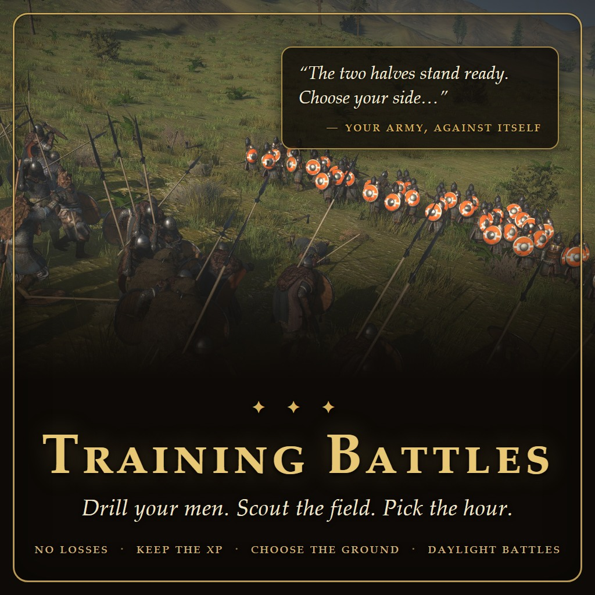


## Looking for…?

If one of these searches brought you here — yes, this is that mod:

- a mod for **practice battles** / **sparring** — train your troops
- a mod for **naval training battles** / practice **sea battles** with your own fleet (War Sails)
- a mod for **siege practice** — storm or defend **your own castle or town walls** in a mock siege
- a mod to **change the time of day of battles** — fight at **full bright daylight**, night, dawn, noon or evening
- a mod to **pick the battlefield** / **choose where you fight** before a battle
- a mod to **scout the battlefield before the battle** — walk it on foot, see the real deployment lines
- a mod to **preview the deployment** before committing to an attack
- a mod to **free sail your ship** — take the **flagship** out with your crew and scout the sea lanes (War Sails)


A mod for *Mount & Blade II: Bannerlord* built on two pillars:

## Pillar 1 — Training battles


- **Split your army** into two halves through a troop-picking GUI, choose which half you command
- **At sea too (War Sails)** — drill while sailing: the fleet divides with the men (proportional to crew, your flagship stays yours) — or divide it **at your word** through the ship-divide window, sending exactly the hulls you choose opposite. Every hull comes back afterward — sunk, damaged or "captured", training costs no ships
- **Pay** for the drill - broken javs, arrows, rewards, they cost money... (1 daily wage by default, 2 at sea)
- **Fight** on the battlefield (attacking or defending) or auto resolve — one side choice governs both roads
- **Level up** your soldiers - keep a share of the XP, scaled by your **Quartermaster** (the **First Mate** at sea) — a great one even earns bonus XP
- the **KIA** -> most get back up; a few wake up wounded, and in unlucky cases there is a real casualty — a good **Surgeon** helps a lot (deaths can be turned fully off)
- the **Wounded** -> they get up OK; a few may stay wounded, the surgeon again
- **No loot** - no loot is preserved after (works even with Bannerloot mod)
- **Disorganized** after - they had to form up etc
- **Cooldown** - you have to wait before you can do another drill (24 in game hours by default)

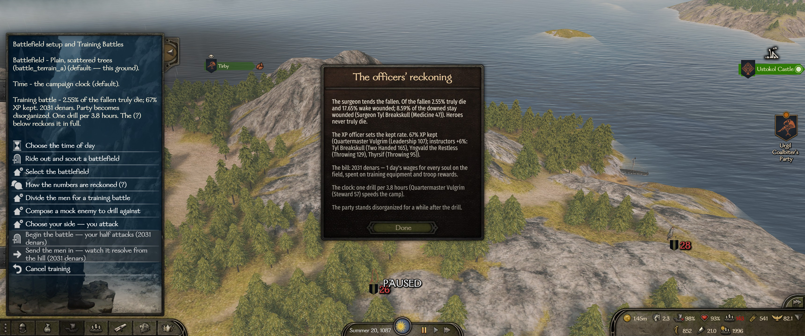
*The muster menu (hotkey `G` on the map): set the ground and the hour, divide the men, pick your side — and the (?) option spells out the officers' full reckoning before you pay a denar.*

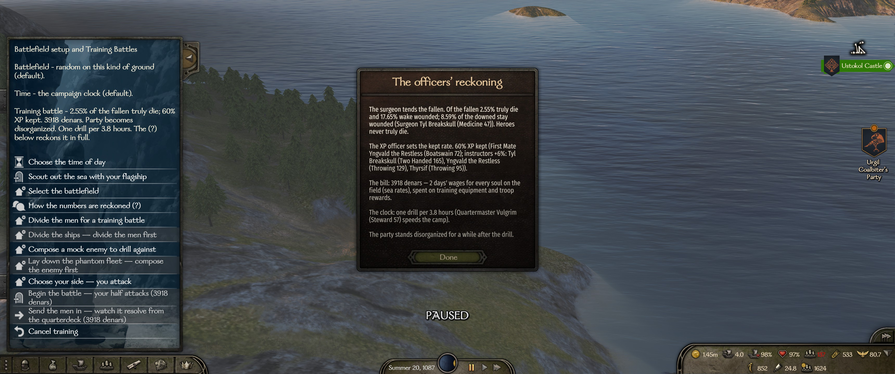
*The same muster afloat (War Sails): scout with the flagship, divide the ships at your word, or lay down a phantom fleet for the mock enemy.*

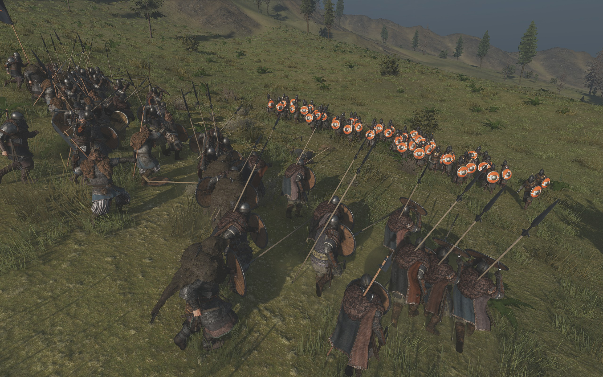
*Your two halves meet on the real terrain of your map position. Nobody truly dies.*

**Mock enemy** *(on by default, can be turned off)* — compose a phantom enemy force from **every
troop in the game**, all cultures in one picker screen, any mix, up to 1000 men — and drill
the whole company against it. The phantoms never touch your roster and vanish afterward;
your own men follow the normal training rules. The test bench for "how would we fare
against X?". At sea the mock enemy **sails**: lay down the phantom fleet — any culture's
hulls, fitted as well as you please — and its ships vanish with its men.

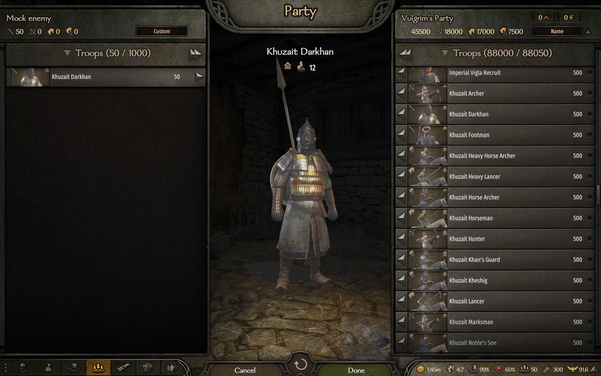
*Composing a mock enemy: every troop in the game, 500 of each on the shelf, any mix up to 1000 men.*

**Siege drills — castles and towns** — at your **own castle or town** the muster becomes a
**siege drill**: storm your own walls or hold them, on the real scene at its true wall
level. The **garrison and militia** always stand with the defense (take them into your
party first to command them yourself), your **Engineer** readies the siege equipment for
both sides, and everyone on the field follows the same training rules — wounds healed, XP
kept, the surgeon watching over the fallen. A grand muster is a public event: it costs more
than a field drill, each stronghold keeps its own clock, and the realm takes note — a little
**renown and influence**. Storm a town whose defenders pull back in good order and the
**Lord's Hall** waits past the walls — pick your best few and finish the drill in the keep,
or let them stand. The mock enemy comes to the walls too: phantoms besiege you when you
hold, reinforce the garrison when you storm. The drill waits behind its own option on the
castle and town menus.

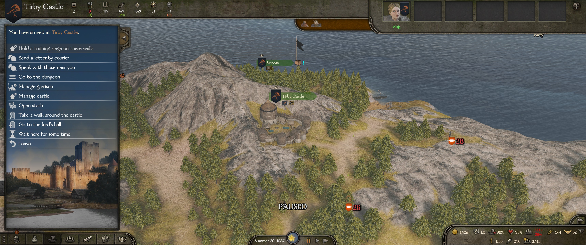
*Arrive at your own castle and the option is waiting: "Hold a training siege on these walls."*

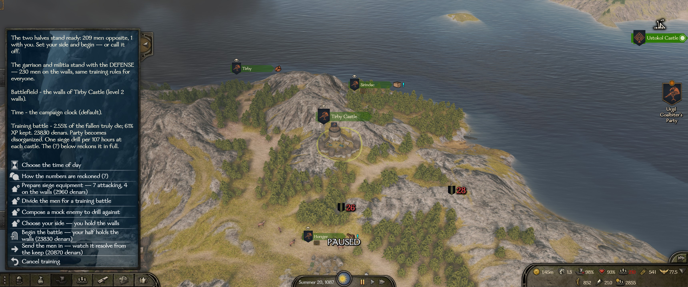
*The siege muster armed: the halves divided, the garrison and militia counted on the walls, the engineer's equipment picked and priced.*

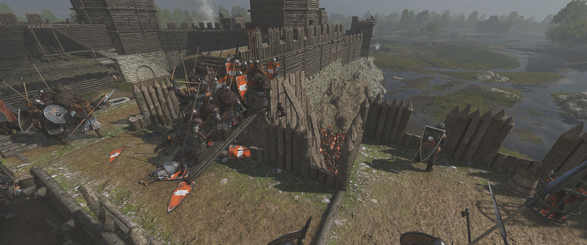
*Your half storms your own walls — real scene, real wall level, and the training-orange shields tell friend from drill-foe.*

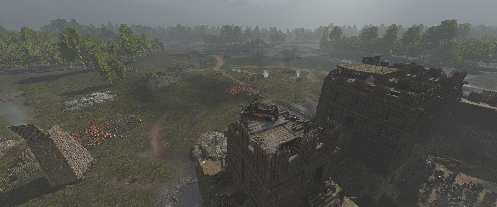
*Holding the walls: the engineer's engines manned on the towers while the mock columns muster below.*


## Pillar 2 — Scouting & choosing your ground

What a real general does before the battle: know the field — and pick the hour.

- **Choose the time of day** — morning, noon, afternoon, evening, night, or the campaign clock (default). Applies to drills, real field battles, sieges and sea battles alike
- **Select the battlefield** — pick from every battlefield the game could use here: the map patch's own scene (marked *"this ground"*) plus every scene of the local terrain type
- **Ride out and scout** — walk any of those battlefields **alone**: no battle, no cost, no cooldown. You spawn on your deployment line, facing the enemy's, distance called out
- **Scout the sea too (War Sails)** — afloat, the same option takes your **flagship** out instead: you and your crew alone on the chosen water. Sail her, row with the men, learn the sea lane — no battle, no cost, no clock, and the hull comes home without a scratch. A free sail, nothing more — by design
- **Scouted lines = drilled lines** — drills use the same deterministic deployment as the scout, so what you scouted is what you get. In a *real* battle the ground holds, but the enemy's true approach direction may turn the field around
- **Same tools in REAL battles** *(per-side toggles, both on by default)* — the encounter menu offers the same options (hour, scout, battlefield) when defending **or** attacking. Both armies stand frozen, so the scouted lines and facings are **exact** — and no time passes while you ride
- **Out-scout to earn it** — in a real battle, picking the ground or a non-daylight hour must be earned: your **Scout** against the enemy's best — nearly as good when defending, clearly better when attacking (the **Navigator** at sea). The campaign clock and full daylight are always free. The lone scout ride is never gated
- **Rule of thumb** — scout from the muster to *learn* the battlefields, scout from the attack screen to *plan the actual fight*

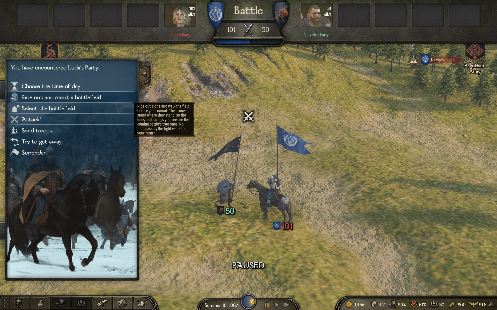
*A real encounter: choose the hour, select the battlefield, or ride out and scout it alone — the armies stand where they stand, so the lines you see are the coming battle's true ones.*

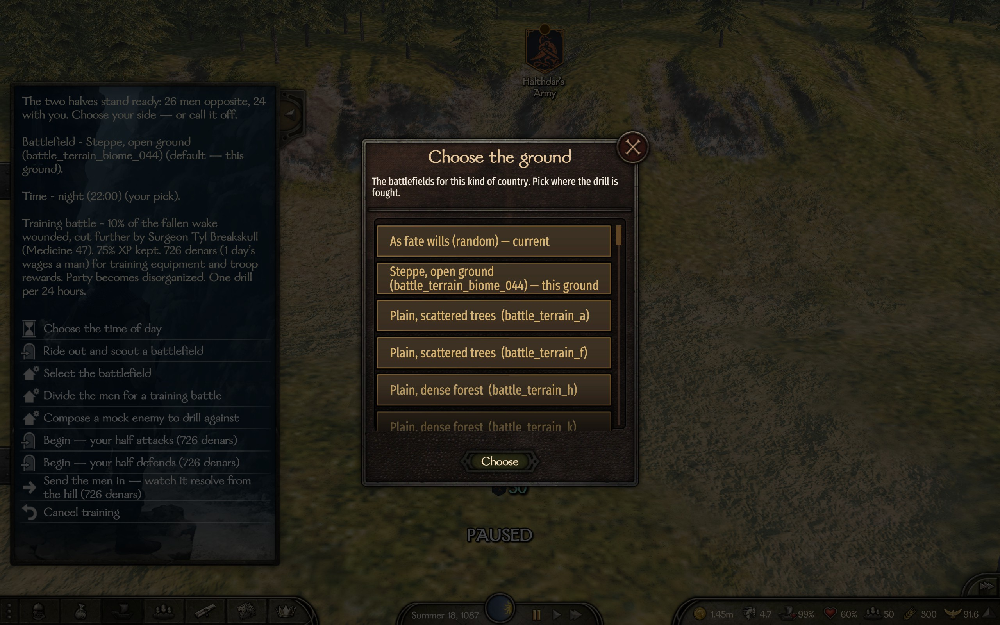
*Choose the ground: the map patch's own scene plus every battlefield of the local terrain type.*


## Your companions matter

The drill yard runs on your officers — every role you fill makes training better:

- **Quartermaster** *(the **First Mate** at sea)* — sets the share of XP the men keep from a drill; a great one even earns bonus XP
- **Your skilled fighters** — the best fighter companions instruct on the yard, adding to the XP kept
- **Steward** — a well-run camp: shortens the time it takes to organize the next drill
- **Surgeon** — fewer incidents in training: fewer real deaths among the fallen, fewer men who stay wounded
- **Engineer** — commands the siege drill's arsenal: higher Engineering unlocks heavier siege equipment for the wall drills
- **Scout** *(the **Navigator** at sea)* — wins you the ground: out-scouting the enemy unlocks the battlefield and hour picks in real battles

All of it tunable in MCM — each officer has their own group of knobs.


## The knobs

Every parameter lives in a JSON config (`Documents\...\Configs\TrainingBattles\config.json`) **and** in the in-game **Mod Configuration Menu (MCM)**. MCM is a soft dependency — without it the config file alone runs the show.

- **Officer knobs** — the Quartermaster's XP band, the fighter-instructor bonus, the Steward cooldown speed-up, the Surgeon's death/wounded bands, the Engineer's equipment tiers, the scouting duel ratios (each officer has its own MCM group)
- **Drill knobs** — hero health restored %, cooldown hours, drill pay (land and sea, days of wages), each stronghold's own pay and clock (castle and town), the prestige rates, disorganized toggle, auto-split-in-half, the opponent half's banner (any banner-editor code)
- **Ground & time knobs** — time of day for battles, the real-battle scout toggles (defending and attacking separately)
- **Misc** — the mock-enemy and siege-drill toggles, the hotkey (default `G` on the campaign map), debug logging

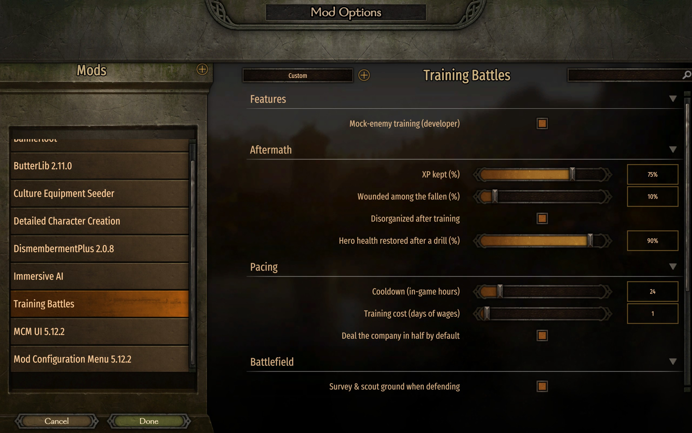
*Every knob in MCM — sliders for the aftermath, the pacing and the battlefield tools.*


## The road ahead

Next milestones, in the order they'll likely land:

- **Army training** — drill while leading a hosted **army**: march the whole banner against a mock enemy

No dates promised — this is a hobby, and playtesting sets the pace.


## Freely given

- **Public domain** — no license, no strings, no permission to ask ([The Unlicense](LICENSE)). Use it, share it, change it.
- **Want to help?** Give feedback and report bugs
- **No donations** — this is a hobby, done for fun and out of good will; I want to keep money out of it. *"For the love of money is the root of all evil."*
- If you still insist on thanking me somehow — visit [my GitHub acc](https://github.com/TraxData313) and read the top pinned


## For developers

Same two-hands team as [Immersive AI](https://github.com/TraxData313/ImmersiveAI) — Anton dreams and playtests, Claude designs and writes the code. Ideas land in [TASKS_TODO.md](TASKS_TODO.md) (details in [AI_NOTES.md](AI_NOTES.md)), finished work moves to [TASKS_DONE.md](TASKS_DONE.md), deep documentation lives in [CLAUDE.md](CLAUDE.md).

| Project | Target | Purpose |
|---|---|---|
| `src/TrainingBattles.Core` | netstandard2.0 | Game-independent logic: aftermath math, cooldown. Unit-tested. |
| `src/TrainingBattles.Module` | net472 | The Bannerlord module: menus, picker GUI, the battle, scouting, aftermath. References game DLLs. |
| `tests/TrainingBattles.Core.Tests` | net8.0 | xUnit tests for Core. |

**Build & deploy** (requires the .NET 8 SDK and a Bannerlord install; path in
`Directory.Build.props`):

```powershell
dotnet build -c Release                                      # build everything
dotnet test  -c Release                                      # Core unit tests (keep green)
powershell -ExecutionPolicy Bypass -File tools\deploy.ps1    # build + install into the game
```